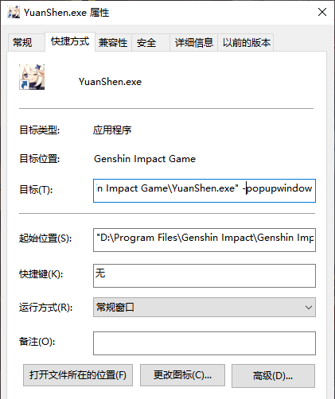

## 原神模块说明

### 使用要求

1. 原神功能模块为第三方工具，所有第三方工具都**不保证没有封号风险，怕别用，封认罚，损失自行承担**
   
   > 游戏脚本一直是灰色地带，使用该功能请勿在游戏官方的账号、平台处（如B站游戏官方的动态，米游社）跳脸，引发游戏方注意，否则可能导致该脚本和其他脚本都使用不了。部分论坛也有限制脚本的使用、传播和讨论

2. SGA原神模块适用于pc端游戏“原神”，支持win10/win11/官服/B服，不支持手机端。win7因为缺少测试样本，使用此脚本可能遇到未知错误。使用该脚本应确保游戏无太多明显卡顿、无键鼠干扰、弹窗干扰，否则都可能遇到未知错误

3. 使用前请将游戏设置为长宽比16:9的全屏或窗口（如:`2560 * 1440`,`1920*1080`，`1600*900`），且尽量选用高分辨率（`1600*900及以上）以提高识图准确率。如需手动启动游戏，请将游戏本体设置为无边框启动

4. 无边框启动设置：右键游戏本体（非启动器）的exe文件的快捷方式，点击属性，点击快捷方式，在目标栏追加输入` -popupwindow`(请注意不要漏掉空格）

5. 如需从脚本启动游戏，请设置好自己的游戏启动路径
   
   

### 功能介绍

该模块操作方案实际上是在关键节点具有识图和判断功能的连点器，且目前只能保持前台操作，任何键鼠干扰、其他软件弹窗和游戏明显卡顿都可能导致该模块功能执行失败

该模块没有任何修改内存的功能，只会模仿人类操作习惯进行键鼠操作，不存在作弊功能

使用该模块需要切换特定队伍配置和跑图角色，请按照对应提示配置自己的队伍，并确保每次运行时为该队伍和跑图角色

游戏中途使用SGA，请确保游戏画面在大世界或者`esc`界面，否则SGA无法识别游戏所处界面

请设置游戏本体的路径（而非启动器），并选择对应服务器类型。路径格式可参照:`D:\\Program Files\\Genshin Impact\\Genshin Impact Game\\YuanShen.exe`

#### 切换队伍功能

第一次使用请亲手配置队伍，为SGA保留左边/上边第一个队伍为跑图队伍。队伍需求

1. 1号位为任意成女体型角色(如`丽莎`，`雷电将军`），武器、天赋、队伍共鸣不应有加速buff

2. 2号位为草元素主角或纳西妲，用于捕捉晶蝶的机关触发

3. 队伍中应有`早柚`,`瑶瑶`等角色，用于捕捉晶蝶

#### 探索派遣功能

请勿选择重复

#### 参量质变仪功能提示

1. 该功能会按照从上到下顺序添加材料直到填满，请在SGA文件夹中的`resource\genshin\picture` 文件夹中选择材料
   
   > 根据材料种类打开文件夹：养成道具 `develop_tools` 或食物 `food` 或材料 `material`，选择需要添加的材料
   > 按照以下示例格式一项一条地填写：`resource\genshin\picture\develop_tools\bugle1.png`

2. 可自行设置其他添加材料，设置方法如下
   
   1. 在游戏`1080p窗口`或`1080p全屏` 截取背包中材料的图像，保存格式为`png`，放置于同目录`resource\genshin\picture`中的对应的文件夹中
   2. 截取图片应为标图方框内，不包括材料数量的材料图案。同时图案不宜过小，会影响识别率
   3. 文件名可自拟，但应是字母与数字的组合

#### 捉晶蝶功能

1. 使用本功能请确保对应地图通畅，如：锚点开启，附近任务已完成，有关解密已完成，等等

2. 晶蝶捕捉有随机性，但有捕获保底数量，能满足一般日常消耗

#### 合成树脂功能

请确保运行到该项目时，晶核数量足够

#### 尘歌壶功能提示

目前只适配璃月主楼。使用本功能请手动将默认壶内的主楼换为璃月主楼（与地图场景无关）

#### 砍树功能

目前树种和位点不全，请至少选择5个点位以确保能完成砍树有效循环

#### 结束后操作功能

1. 该功能会在完成以上所有功能后,执行子设置中的操作

2. 启用继续执行时，会在完成以上所有操作后紧接着运行选中的配置。可点击刷新按钮，刷新当前可用配置
