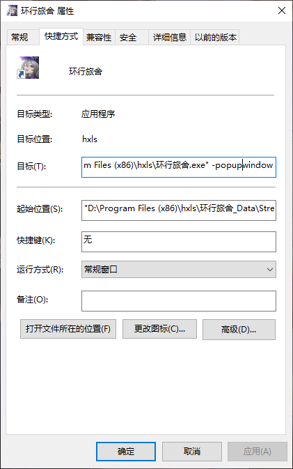

## 环行旅舍模块说明

### 使用要求

1. 环行旅舍功能模块为第三方工具，所有第三方工具都**不保证没有封号风险，怕别用，封认罚，损失自行承担**
   
   > 游戏脚本一直是灰色地带，使用该功能请勿在游戏官方的账号、平台处（如B站游戏官方的动态，tap游戏官方账号、论坛）跳脸，引发游戏方注意，否则可能导致该脚本和其他脚本都使用不了。部分论坛也有限制脚本的使用、传播和讨论

2. SGA环行旅舍模块适用于pc端游戏`环行旅舍`，支持`win10`/`win11`/`官服`/`B服`，不支持手机端。`win7`因为缺少测试样本，使用此脚本可能遇到未知错误。使用该脚本应确保游戏无太多明显卡顿、无键鼠干扰、弹窗干扰，否则都可能遇到未知错误

3. 使用前请将游戏设置为长宽比`16:9`的全屏或窗口（如:`2560 * 1440`,1920*1080`,`1600*900`），且尽量选用高分辨率（`1600*900`及以上）以提高识图准确率。如需手动启动游戏，请将游戏本体设置为无边框启动

4. 无边框启动设置：右键游戏本体（非启动器）的exe文件的快捷方式，点击属性，点击快捷方式，在目标栏追加输入` -popupwindow`(请注意不要漏掉空格）

5. 如需从脚本启动游戏，请设置好自己的游戏启动路径
   
   

### 功能介绍

该模块操作方案实际上是在关键节点具有识图和判断功能的连点器，且目前只能保持前台操作，任何键鼠干扰、其他软件弹窗和游戏明显卡顿都可能导致该模块功能执行失败

该模块没有任何修改内存的功能，只会模仿人类操作习惯进行键鼠操作，不存在作弊功能

游戏中途使用SGA，请确保游戏画面在平面操作的主界面

请设置游戏本体的路径（而非启动器），并选择对应服务器类型。路径格式可参照：`D:\Program Files (x86)\hxls\环行旅舍.exe`

#### 作战功能

1. 该功能在使用时不会使用“能源回复装置”和因购买能源，但会使用当前全部能源

2. 重游选框会在游戏已有完成作战时领取作战奖励并尝试重复上次作战，启用该选框时会无效化材料选择选框，即使当前没有已完成作战。该功能用于连续刷取特殊材料和活动关卡（每次第一次刷取请手动开启，活动关卡再次重游可能无效）

3. 目前材料选择仅支持定格帧（养成材料）最高等级的三种关卡：获取`格`，`风物志`，`节`

#### 线下采购功能

1. 材料选择请勿重复，按照顺序选择效率最佳

2. 方案选择会在前四行优先寻找选定项目的舍友，没有找到合适的舍友会默认选择第一名

3. 启用再次采购时，选择项目会无效

#### 战术回顾功能

1. 目前仅支持选框内的项目，并为所有战术回顾选择

2. 由于能力所限，目前部分选项选择成功率并不为100%（例如28%可能误选到23%）。不支持自动替换掉满经验的舍友

#### 集市功能

该功能会自动领取集市中的：`礼包商城-每日配给`,`援外商区-援外协议`。但**不会自动使用**援外协议，请自行使用

#### 舍友访募功能

1. 目前版本该功能已较完善，但因为测试样本不大，可能遇到未知错误，请谨慎使用

2. 该功能识别到必出SR、SSR时会自动跳过

3. 普通访募识别到，招募出SR、SSR时会自动截图保存在`resource\hxls\screenshot`文件夹中，并命名截图为领取时的时间。可点击该子设置页面的历史按钮打开文件夹查看截图

4. 启用加速选框功能，会一直使用高速显影剂和外显记录直到缺少高速显影剂或外显记录或格，但不会对启用功能前已开始的招募使用加速

#### 今日工作功能

该功能会领取当前所有今日工作奖励，不会进行兑换

#### 卡门商网功能

该功能会领取当前所有波频经验，但不会领取奖励

#### 随机包功能

1. 目前版本该功能尚不完善，部分随机包没有收集到素材因此不能识别
   
   > 如果你有不能识别的随机包，可以联系B站账号：`绘星痕`，帮助功能完善

2. 该功能会使用物资里的所有已可识别的随机礼包，但不会使用自选礼包和其他物品

#### 结束后操作功能

1. 该功能会在完成以上所有功能后,执行子设置中的操作。 

2. 启用继续执行时，会在完成以上所有操作后紧接着运行选中的配置。可点击刷新按钮，刷新当前可用配置
