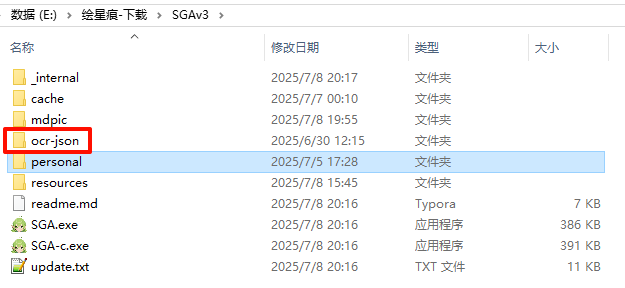
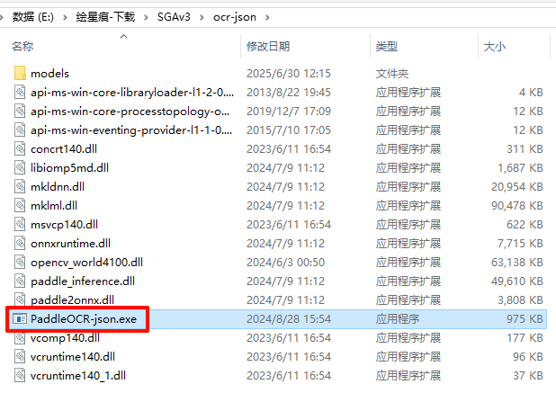
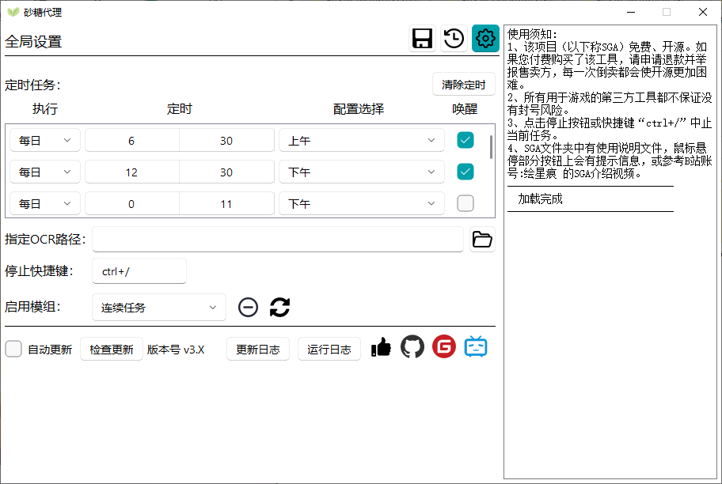
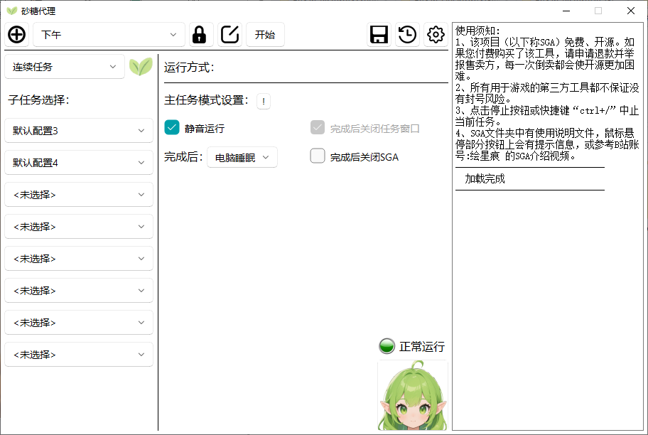
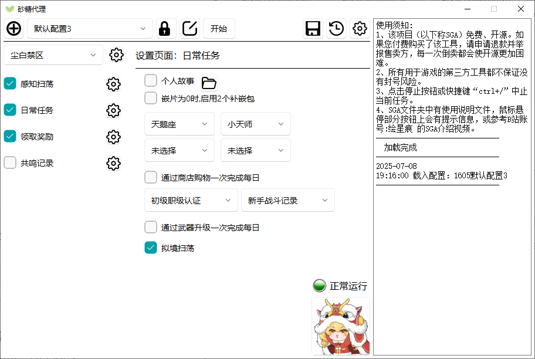

# SGA-SucroseGameAssistant-v3
###  该分支为[SGAv3](https://gitee.com/huixinghen/SucroseGameAssistant/tree/master-v3/)，若需[SGAv2](https://gitee.com/huixinghen/SucroseGameAssistant/tree/master-v2/)版本请切换分支
## 功能简介
砂糖代理（SGA）需要运行在win10系统，用于定时循环执行各模块的相关功能。可设置完成后睡眠和从睡眠中唤醒，从而避免电脑在非必要时长期运行。  
目前SGA已适配尘白禁区，原神，MAA，三月七助手等游戏，并支持使用通用执行模块启用其他第三方自动化软件。

####  SGA开源免费，源代码将同时更新于: [github](https://github.com/Kin-L/SucroseGameAssistant) / [gitee](https://gitee.com/huixinghen/SucroseGameAssistant)

####  目前作者只更新尘白禁区模块和SGA主体，欢迎新的合作者参与对其他模块进行更新适配  
### 联系方式

    邮箱: 2805137028@qq.com  
    bilibili站账号: 绘星痕（406315493）  
    https://space.bilibili.com/406315493  
    抖音：绘星痕（54796280232）  
    QQ群聊仅作bug反馈和交流使用，不完全公开。可以B站私信我或邮件联系我索要群聊号。  

## 建议运行环境

- SGA推荐环境为win10 专业版
- 游戏窗口最佳分辨率1920×1080(最低1600×900)
- 尘白禁区模块的推荐启动器为[尘白禁区启动器](https://wwrv.lanzouu.com/iSGYZ30gqnpe?pwd=gfhg#gfhg "前往下载尘白禁区启动器")    
## 已有功能模块
### v2已支持所有模块，v3版本将陆续增加相关适配  
- 环行旅舍(功能停止更新)  
- 原神  
- MAA（明日方舟）  
- 三月七助手  
- 尘白禁区(推荐使用“尘白禁区启动器”)  
- 通用执行  
- 连点器  
- 绝区零助手  
- 鸣潮助手  
- 琴音小助手  

## 下载、安装与更新指南
### 视频教程
[SGAv3介绍](https://www.bilibili.com/video/BV1tSGnzXEdg)  
[SGAv3快速上手指南](https://www.bilibili.com/video/BV13kGuzfERf)  
1.  从网盘下载带"full"后缀的最新安装包。蓝奏云有最大包体限制，需要额外下载OCR组件（大多数电脑使用“PaddleOCR-json”），需全部下载才能解压  
    1.  SGA-full包体  
        1.  [蓝奏云下载](https://wwrv.lanzouu.com/b002v5cgdg) 密码:faml  
        2.  [123云盘下载](https://www.123pan.com/s/PjLbVv-9kEuA.html) 提取码:stdl  
        3.  [百度云盘下载](https://pan.baidu.com/s/1OhXjg--R-a2YRPj9f5TNxA?pwd=33vp) 提取码: 33vp
    2.  OCR-json  
        1.  [蓝奏云下载](https://wwrv.lanzouu.com/b033h9ybi) 密码:1siv  
        2. [123云盘下载](https://www.123865.com/s/PjLbVv-9R1uA) 提取码:ICSl  
        3. [百度云盘下载](https://pan.baidu.com/s/1w6hD8UaCDQ7gj7kB8jvFnw?pwd=xrvx) 提取码: xrvx
2.  SGA为绿色免安装版，解压后可用，需要管理员权限   
3.  更新方案(每个更新包有最低适用版本的限制，无法在低于版本限制的版本上应用该更新包)：  
    1.  在全局设置页面可选自动更新，和立即检查更新。  
    2.  手动更新，在gitee的[release](https://gitee.com/huixinghen/SucroseGameAssistant/releases)中找到对应版本号，下载带有"replace"后缀的压缩包，解压后将SGA文件夹与原SGA文件夹中同名文件夹进行合并并替换。   
  
## 快速上手
1.  使用管理员权限打开SGA.exe文件
2.  点击左侧“连续任务”下拉选框，选择要执行的模块  
3.  点击右侧齿轮样图标进入模块设置页面，选择服务器并输入启动器绝对路径  
4.  勾选左侧要执行的任务  
5.  点击对应齿轮样图标进入子设置页面，选择要执行的任务  
6.  如果从蓝奏云下载，需要额外指定OCR组件路径。
点击上方齿轮按钮，切换到全局设置界面，输入或指定OCR.exe的绝对路径。
或参考图片将OCR组件的文件置于如下两图的目录结构

7.  点击上方“开始”按钮，开始执行任务  
8.  使用快捷键（默认为“ctrl+/”）快捷中止运行中的任务

## BUG反馈 / 问题解决
1. 遇到bug可尝试更新，确认是否为最新版本
2. 若SGA主体部分出现问题(如闪退，卡死等)，确认自己系统是否为win10。
SGA在win10 专业版上开发和测试，在 win7/win11/win10其他精简版 可能遇到未知问题，
作者暂时没有条件解决（意思是非win10环境中遇到的bug可能无法解决）
3. 如果在执行任务过程中遇到问题
   1. 如果是SGA自带的功能模块，出现点击不到位的，无效点击，
   超时等问题，可以尝试将游戏窗口调至1920*1080分辨率。
   （该类问题可能是SGA多分辨率逻辑适配不到位导致的）
   2. 如果是SGA启动第三方自动化软件的模块，如果已经将第三方软件启动成功，
   开始执行，则可能是第三方自动化软件的问题
   3. 如果第三方软件启动过程报错，可能是SGA的BUG
4.  SGA卸载删除前请 清除定时 ，否则您的电脑可能遇到仍在您原来设定过的时间 睡眠中自行唤醒 的情况。
如果您已经卸载删除且遇到该情况，可在按照百度教程找到 任务计划程序 ,找到 SGA-awake 的条目，禁用/删除即可解决该问题。
5.  SGA为绿色免安装版，无联网功能，运行需要管理员权限，用于软件启动、设置定时等。
若出现报毒和添加信任事件，信则用，本人没有心情也没有能力写病毒和盗号功能。
添加信任可参考：[知乎帖子](https://zhuanlan.zhihu.com/p/645089615)
6. 如果以上说明不能解决你遇到的问题，可以通过以下方式联系/反馈，
如果问题较复杂我可以私信Q群聊号，群聊仅作反馈bug和交流开发SGA用
   1. bilibili账号(推荐)
   2. 邮箱(推荐)
   3. github / Gitee issues (不常看issue，可能回复较慢)
7.  反馈BUG建议说明以下信息，越详细越能助我快速定位和解决问题
    1.  自己的环境（win10/win11/win7, 官服/B服）
    2. 触发bug的流程/停留的界面/bug触发的录屏、截图
    3. SGA文件夹中“personal”文件夹中的“errorsc”，“logs”（重要）文件夹，
    压缩打包发给我，如果可能请将整个“personal”文件夹打包
## 部分资源链接
[尘白禁区启动器](https://wwrv.lanzouu.com/iSGYZ30gqnpe?pwd=gfhg#gfhg "前往下载尘白禁区启动器")     
[OCR-json](https://wwrv.lanzouu.com/b033h9ybi) 密码:1siv  
## 用户界面展示
### 全局设置页面

### 连续执行 模块页面

### 尘白禁区 模块页面

## 特别感谢

1.  SGA用户界面使用了[PyQt-Fluent-Widgets](https://github.com/zhiyiYo/PyQt-Fluent-Widgets)  

2.  SGA部分代码和学习过程中参考了三月七助手，并组合使用了[三月七助手](https://moesnow.github.io/March7thAssistant)  

3.  SGA原神模块的自动秘境功能组合使用了[BGI](https://github.com/babalae/better-genshin-impact)的自动秘境功能  

4.  SGA组合使用了[MAA](https://github.com/MaaAssistantArknights/MaaAssistantArknights)  
